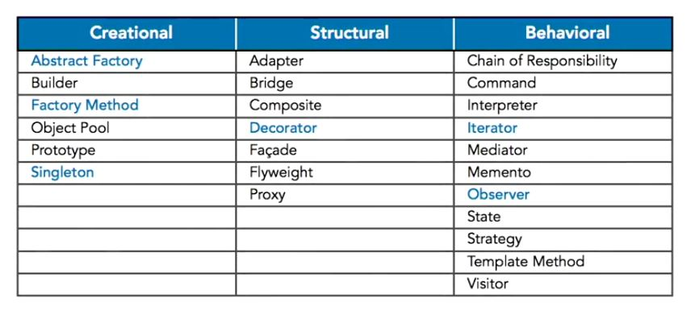

# Studying-CSharpDesignPatterns-LyndaDotCOm
Sutyding &amp; example repo of common design patterns: https://www.lynda.com/C-tutorials/C-Design-Patterns/473890-2.html.

## Creational [goto](https://github.com/KodeFoxx-Projects/Studying-CSharpDesignPatterns-LyndaDotCom/tree/master/Source/Creational)
- [Factory Method](https://github.com/KodeFoxx-Projects/Studying-CSharpDesignPatterns-LyndaDotCom/tree/master/Source/Creational/Kodefoxx.Studying.CsDesignPatterns.FactoryMethod)
- Abstract Factory(https://github.com/KodeFoxx-Projects/Studying-CSharpDesignPatterns-LyndaDotCom/tree/master/Source/Creational/Kodefoxxx.Studying.CsDesignPatterns.AbstractFacto)

## Structural

## Behavioral

