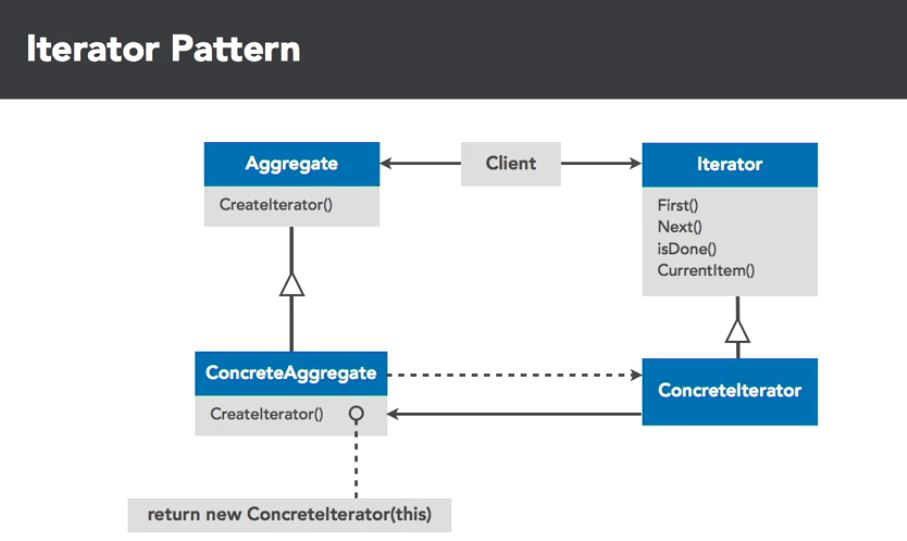

## Iterator
Provide a way to access the elements of an aggregate object sequentially without exposing it's underlying representation. In essence it provides a way to access and iterate through collections in the same way, regardless of type.

