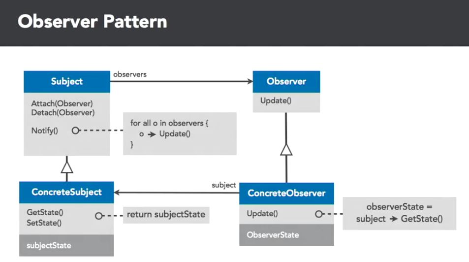
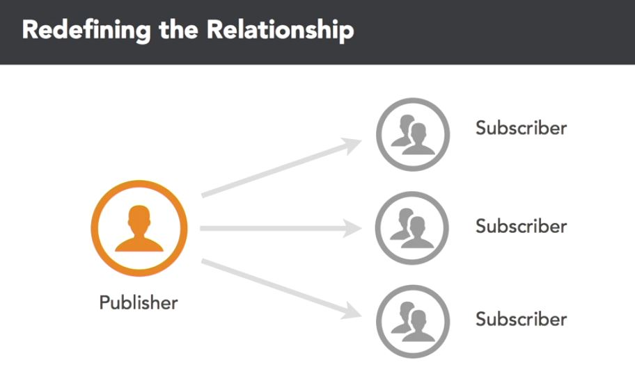

## Observer
Defines a one-to-many dependency between objects so that when one object changes state, all it dependents are notified and updated automatically. So, a change in one object causes a change or action in another.

On can draw the analogy to a publisher notifying it's observers. A publisher could be a course, and it's observers could be students. When a course adds a task, all the students are notified...
