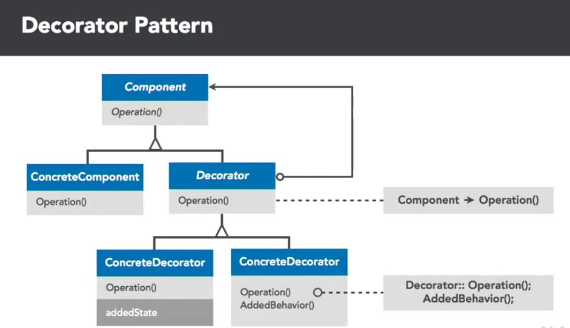
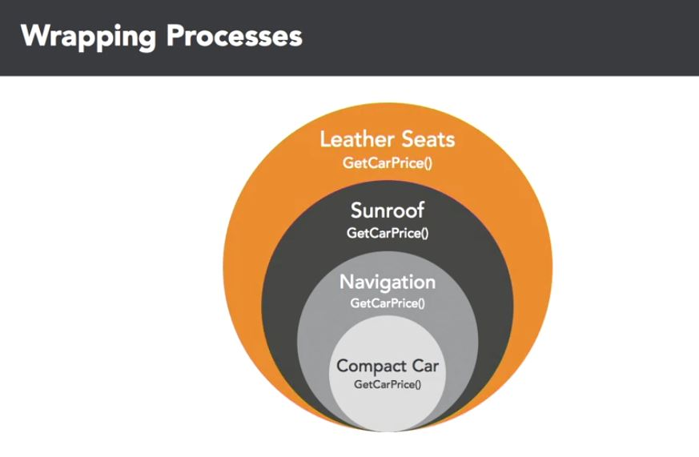

## Abstract Factory
Also known as the "wrapper-pattern", it attaches additional responsibilities to an object dynamically. Decorators provide a flexible alternative to subclassing for extending functionality. It's all about composition, using it to limit inheritance and simplify object relationships to make them more manageable.

